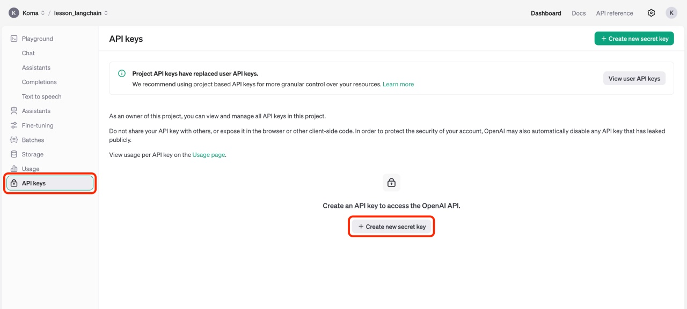

<style scoped>
  section {
    align-items: center;
    justify-content: center;
  }
  h1 {
    color: #f8f8f2;
    font-size: 120px;
  }
  img {
    border: 20px solid white;
    border-radius: 10%;
  }
</style>


# LangChain

---
<style scoped>
  section {
    font-size: 40px;
  }
  h1 {
    font-size: 50px;
    color: #f8f8f2;
  }
  li {
    font-family: Menlo;
    font-size: 32px;
  }
</style>

# :books: 写个简单的Chat程序 - OpenAI

操作步骤

+ 生成 OpenAI API Key
+ 开发 Chat 程序

---
<style scoped>
  section {
    align-items: center;
    justify-content: center;
  }
  h1 {
    color: #f8f8f2;
    font-size: 200px;
    margin: 0;
  }
  img {
    border: 10px solid #f8f8f2;
    border-radius: 20%;
    margin: 0;
  }
</style>


# 操作演示

---
<style scoped>
  h3 {
    margin-top: 0;
  }
  img {
    border: 5px solid #f8f8f2;
    border-radius: 10;
    display: block;
    margin: 0 auto;
  }
</style>
## 生成 OpenAI API Key

### OpenAI 管理控制台
https://platform.openai.com/playground




---
<style scoped>
  h3 {
    margin-top: 0;
  }
</style>
## 开发 Chat 程序

### main.py
```python
import os, pprint, json, time
from common import *
from dotenv import load_dotenv
from langchain_openai import ChatOpenAI

start_time = time.time()  # 获取开始时间

load_dotenv()  # 读取.env文件

model = ChatOpenAI(model="gpt-4o-mini")

result = model.invoke("你好")
# result = model.invoke("我想去澳洲留学，给我一些建议好吗？")
pprint.pprint(result)
pprint.pprint(result.content)

print()
print(evalEndTime(start_time))
```

---
<style scoped>
  section {
    align-items: center;
    justify-content: center;
  }
  h1 {
    color: #f8f8f2;
    font-size: 200px;
  }
</style>

# 下课时间

