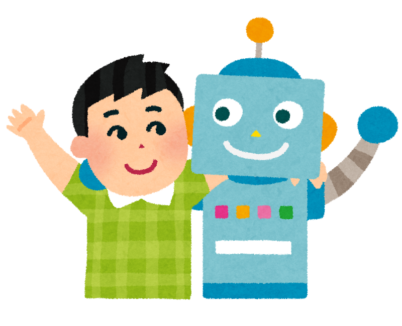

<style scoped>
  section {
    align-items: center;
    justify-content: center;
  }
  h1 {
    color: #f8f8f2;
    font-size: 120px;
  }
</style>


# LangChain

---
<style scoped>
  section {
    font-size: 40px;
  }
  h1 {
    font-size: 50px;
    color: #f8f8f2;
  }
  li {
    font-family: Menlo;
    font-size: 32px;
  }
  img[alt~="chatrobot"] {
    position: absolute;
    right: 20px;
    bottom: 0px;
  }
</style>

# :books: 写个命令行聊天工具

操作步骤

+ 使用 ChatBedrock 模型开发个基于命令行的聊天程序



---
<style scoped>
  section {
    align-items: center;
    justify-content: center;
  }
  h1 {
    color: #f8f8f2;
    font-size: 200px;
    margin: 0;
  }
  img {
    border: 10px solid #f8f8f2;
    border-radius: 20%;
    margin: 0;
  }
</style>


# 操作演示

---
<style scoped>
  h3 {
    margin-top: 0;
  }
</style>
## 课堂实验

### main.py

```python
import os, pprint, json, time
from common import *
from dotenv import load_dotenv
from langchain_aws import ChatBedrock
from langchain_core.messages import AIMessage, HumanMessage, SystemMessage

start_time = time.time()  # 获取开始时间
load_dotenv()

messages = [
    SystemMessage("你是一语言专家,精通英语和中文。所有回答请限制在35个字以内。"),
]

model = ChatBedrock(
    credentials_profile_name="deeplearnaws",
    region_name="us-east-1",
    model_id="anthropic.claude-3-haiku-20240307-v1:0",
    model_kwargs={
        "max_tokens": 512,
        "temperature": 0,
        "top_p": 1.0,
    },
)

while True:
    user_input = input("> ")
    if user_input.lower() == "exit":
        break
    elif len(user_input.strip()) == 0:
        continue

    # 将用户消息加入数组
    messages.append(HumanMessage(user_input))

    # 调用模型
    result = model.invoke(messages)

    # 将模型返回的消息加入数组
    messages.append(AIMessage(result.content))
    print("AI:", result.content)

print(evalEndTime(start_time))
pprint.pprint(messages)
```

---
<style scoped>
  section {
    align-items: center;
    justify-content: center;
  }
  h1 {
    color: #f8f8f2;
    font-size: 200px;
  }
</style>

# 下课时间

