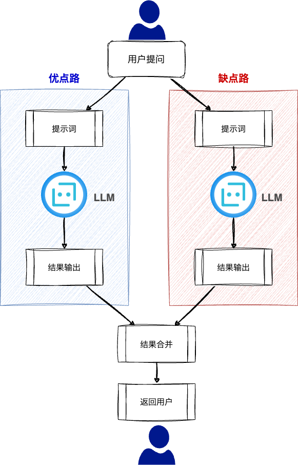

<style scoped>
  section {
    align-items: center;
    justify-content: center;
  }
  h1 {
    color: #f8f8f2;
    font-size: 120px;
  }
</style>


# LangChain

---
<style scoped>
  section {
    font-size: 40px;
  }
  h1 {
    font-size: 50px;
    color: #f8f8f2;
  }
  li {
    font-family: Menlo;
    font-size: 32px;
  }
</style>

# :books: 并行思考处理

操作步骤

+ 针对于用户的一个提问，分两个链路进行思考回答，然后合并思考结果，同时返回给用户

---
<style scoped>
  h1 {
    font-size: 64px;
    color: #f8f8f2;
    margin: 0;
  }
  section {
    align-items: center;
    justify-content: center;
  }
  img {
    background-color: white !important;
    border-radius: 3%;
    margin: 0;
    border: 15px solid #f8f8f2;
  }
</style>

# 系统架构



---
<style scoped>
  section {
    align-items: center;
    justify-content: center;
  }
  h1 {
    color: #f8f8f2;
    font-size: 200px;
    margin: 0;
  }
  img {
    border: 10px solid #f8f8f2;
    border-radius: 20%;
    margin: 0;
  }
</style>


# 操作演示

---
<style scoped>
  h3 {
    margin-top: 0;
  }
</style>
### main.py

```python
import time
from common import *
from dotenv import load_dotenv
from langchain_aws import ChatBedrock
from langchain.prompts import ChatPromptTemplate
from langchain.schema.output_parser import StrOutputParser
from langchain.schema.runnable import RunnableLambda, RunnableParallel

start_time = time.time()  # 获取开始时间
load_dotenv()

# 创建模型
model = ChatBedrock(
    credentials_profile_name="deeplearnaws",
    region_name="us-east-1",
    model_id="anthropic.claude-3-haiku-20240307-v1:0",
    model_kwargs={
        "max_tokens": 512,
        "temperature": 0,
        "top_p": 1.0,
    },
)

# 执行开始
print("=" * 100)
prompt_input_chain = RunnableLambda(
    lambda input: "{language}编程语言".format(language=input["language"])
)

# 优点提示词
def prompt_merit(language):
    messages = [
        ("system", "你是一位经验丰富的编程高手。"),
        ("human", "我想学习{language},请在100个单词以内描述优点."),
    ]
    prompt_template = ChatPromptTemplate.from_messages(messages)
    return prompt_template.format_prompt(language=language)

# 优点分支链
merit_branch_chain = (
    RunnableLambda(lambda x: prompt_merit(x)) | model | StrOutputParser()
)

# 缺点提示词
def prompt_demerit(language):
    messages = [
        ("system", "你是一位经验丰富的编程高手。"),
        ("human", "我想学习{language},请在100个单词以描述缺点."),
    ]
    prompt_template = ChatPromptTemplate.from_messages(messages)
    return prompt_template.format_prompt(language=language)

# 缺点分支链
demerit_branch_chain = (
    RunnableLambda(lambda x: prompt_demerit(x)) | model | StrOutputParser()
)

# 合并分支输出结果
def combine_merit_demerit(branch_outputs):
    merit = branch_outputs["merit"]
    demerit = branch_outputs["demerit"]
    return f"[优点]:\n{merit}\n\n[缺点]:\n{demerit}"

# 合并分支输出结果 Chain 对象
combine_merit_demerit_chain = RunnableLambda(
    lambda x: combine_merit_demerit(x["branches"])
)

# 仅仅输出一下过程中的数据
def output(x):
    print(">", x)
    return x

# 输出中间结果(日志用)
output_chain = RunnableLambda(lambda x: output(x))

# 使用Chain调用模型
chain = (
    prompt_input_chain
    | output_chain
    | RunnableParallel(
        branches={"merit": merit_branch_chain, "demerit": demerit_branch_chain}
    )
    | combine_merit_demerit_chain
    | StrOutputParser()
)

result = chain.invoke({"language": "python"})
# result = chain.invoke({"language": "java"})
print(result)

# 打印结束时间
print(evalEndTime(start_time))
```

---
<style scoped>
  section {
    align-items: center;
    justify-content: center;
  }
  h1 {
    color: #f8f8f2;
    font-size: 200px;
  }
</style>

# 下课时间

