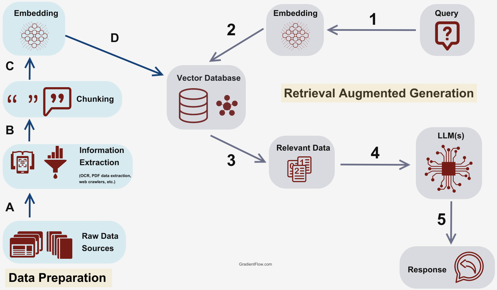

<style scoped>
  section {
    align-items: center;
    justify-content: center;
  }
  h1 {
    color: #f8f8f2;
    font-size: 120px;
  }
</style>


# LangChain

---
<style scoped>
  section {
    font-size: 40px;
  }
  h1 {
    font-size: 50px;
    color: #f8f8f2;
  }
  li {
    font-family: Menlo;
    font-size: 32px;
  }
</style>

# :books: RAG - 从向量数据库中检索文本(retrieve)

操作步骤

+ 从向量数据库中检索文本 (retrieve)

---
<style scoped>
  h1 {
    font-size: 64px;
    color: #f8f8f2;
    margin: 0;
  }
  section {
    align-items: center;
    justify-content: center;
  }
  img {
    border-radius: 2%;
    margin: 0;
    border: 5px solid #f8f8f2;
  }
</style>

# 系统架构



---
<style scoped>
  section {
    align-items: center;
    justify-content: center;
  }
  h1 {
    color: #f8f8f2;
    font-size: 200px;
    margin: 0;
  }
  img {
    border: 10px solid #f8f8f2;
    border-radius: 20%;
    margin: 0;
  }
</style>


# 操作演示

---
<style scoped>
  h3 {
    margin-top: 0;
  }
</style>
### main.py

```python
import os, time
from common import *
from dotenv import load_dotenv
from langchain_community.vectorstores import Chroma
from langchain_openai import OpenAIEmbeddings

print("=" * 100)
start_time = time.time()  # 获取开始时间
load_dotenv()

chroma_dbpath = os.path.join(os.path.dirname(__file__), "db/sanguo.db")
if not os.path.exists(chroma_dbpath):
    print(">", f"未找到存储路径:{chroma_dbpath}")
    exit(0)

# 定义OpenAIEmbeddings
embeddings = OpenAIEmbeddings(model="text-embedding-3-small")

# 定义Chroma
db = Chroma(persist_directory=chroma_dbpath, embedding_function=embeddings)

# 定义client_prompt
client_prompt = "请问桃园结义是几个人？都是谁？"

# 定义retriever
# - https://python.langchain.com/v0.2/docs/integrations/vectorstores/chroma/
retriever_docs = db.similarity_search(client_prompt, k=2)

print(">", "查询文档:", len(retriever_docs))
for i, doc in enumerate(retriever_docs):
    print(f"{i+1}. {doc}")

# 打印结束时间
print(evalEndTime(start_time))
```

---
<style scoped>
  section {
    align-items: center;
    justify-content: center;
  }
  h1 {
    color: #f8f8f2;
    font-size: 200px;
  }
</style>

# 下课时间

