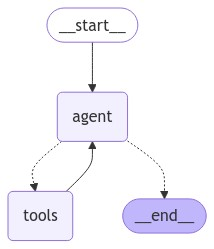

<style scoped>
  section {
    align-items: center;
    justify-content: center;
  }
  h1 {
    color: #f8f8f2;
    font-size: 120px;
  }
</style>


# LangChain

---
<style scoped>
  section {
    font-size: 40px;
  }
  h1 {
    font-size: 50px;
    color: #f8f8f2;
  }
  li {
    font-family: JetBrains Mono;
    font-size: 32px;
  }
</style>

# :books: CSV 文件处理 - 泰坦尼克号数据分析

操作步骤

+ 使用 CSVLoader 加载 CSV 文件
+ 编写运行测试程序

---
<style scoped>
  h1 {
    font-size: 64px;
    color: #f8f8f2;
    margin: 0;
  }
  section {
    align-items: center;
    justify-content: center;
  }
  img {
    border-radius: 2%;
    margin: 0;
    border: 5px solid #f8f8f2;
    box-shadow: 2px 2px 3px black;
    background-color: white !important;
    padding: 20px;
  }
</style>

# 系统架构



---
<style scoped>
  section {
    align-items: center;
    justify-content: center;
  }
  h1 {
    color: #f8f8f2;
    font-size: 200px;
    margin: 0;
  }
  img {
    border: 10px solid #f8f8f2;
    border-radius: 20%;
    margin: 0;
    box-shadow: 2px 2px 3px black;
  }
</style>


# 操作演示

---
<style scoped>
  h3 {
    margin-top: 0;
  }
  pre {
    box-shadow: 2px 2px 3px black;
  }
</style>
### main.py

```python
import time
import common
from dotenv import load_dotenv
from langchain_core.tools import tool
from langchain_openai import ChatOpenAI
from langchain_core.messages import SystemMessage, HumanMessage
from langchain_community.document_loaders import CSVLoader
from langgraph.prebuilt import create_react_agent, ToolNode

print("=" * 100)
start_time = time.time()  # 获取开始时间

load_dotenv()

file_path = "data/titanic.csv"

####################################################################################################
## Tools

@tool
async def loadCSV():
    """
    从CSV文件中加载泰坦尼克号的数据
    """
    loader = CSVLoader(file_path=file_path)
    data = loader.load()
    print(">", f"数据集中的记录数：{len(data)}")
    # gpt-4o or gpt-4o-mini 模型的输入最大为128,000个令牌
    return data[:100]  # 限制为100行, 节省一下令牌成本

tools = [loadCSV]
tool_node = ToolNode(tools=tools)

####################################################################################################
## ReAct Agent

model = ChatOpenAI(model_name="gpt-4o-mini", temperature=0)
agent = create_react_agent(model, tools)
# agent.get_graph(xray=False).draw_mermaid_png(output_file_path="graph.png")

####################################################################################################
## main run
async def run(prompt):

    inputs = {
        "messages": [
            SystemMessage("你是一位数据分析专家, 你会检索CSV数据并回答用户的问题。"),
            HumanMessage(content=prompt),
        ]
    }
    result = await agent.ainvoke(inputs)
    print(result["messages"][-1].content)

    print(common.evalEndTime(start_time))
    return result

if __name__ == "__main__":
    import asyncio
    asyncio.run(run(prompt="请分析一下CSV文件中哪些因素会影响生存率？"))
```

---
<style scoped>
  section {
    align-items: center;
    justify-content: center;
  }
  h1 {
    color: #f8f8f2;
    font-size: 200px;
  }
</style>

# 下课时间

